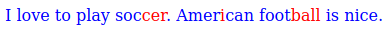

# Syllable.js
This project was created during the [coronavirus pandemic](https://en.wikipedia.org/wiki/2019%E2%80%9320_coronavirus_pandemic) when schools were closed. The aim of the project was the creation of a new web application where children can enhance their reading skills using the Syllable-Method.

So what can you actually do with Syllable.js? You can colorize the syllables of words:

The following text
```
I love to play soccer. American football is nice.
```
transforms to



It works for german texts too. It even works for all languages which are supported by [Hyphenopoly](https://github.com/mnater/Hyphenopoly).

## Installation
Download the latest release of [Hyphenopoly](https://github.com/mnater/Hyphenopoly). You need the follwoing files/directories:

* `Hyphenopoly.js`
* `Hyphenopoly_Loader.js`
* `patterns/<LANGUAGE>.wasm`

Replace `<LANGUAGE>` with the language you actually need. Additionally you need the latest release of Syllable.js.

## Usage
### Simple Example
First you have to load and initialize Hyphenopoly.
```HTML
<script src="./Hyphenopoly_Loader.js"></script>
<script>
  
  Hyphenopoly.config({
    "require": {
      "en-us": "FORCEHYPHENOPOLY"
    },
    "setup": {
      "exceptions": { "global" : ""},
      "selectors": {
        ".hyphenate": {
          "hyphen": "•",
          "minWordLength": 3
        }
      }
    }
  });
</script>
```

Then you can use Syllable.js:
```HTML
<script src="./syllables.js"></script>
<script>
document.addEventListener('DOMContentLoaded', function() {

  Hyphenopoly.hyphenators["en-us"].then((hyphenator) => {

    let sourceText = "I love to play soccer. American football is nice.";

    let syllableConverter = new SyllableConverter(
      {
        hyphenator : hyphenator
      }
    );

    let convertedText = syllableConverter.convertText( sourceText );
  });
}); 
</script>
```

### Further Examples

#### Word Count
After converting a text to syllables the processed word count could be retrieved using function `getWordCount`:

```js
let convertedText = syllableConverter.convertText( "This is a text about Unicorns" );

let wordCount = syllableConverter.getWordCount();
```

#### Changing Colors
To change the default colors for the syllables, the attribute `syllableColors` of the configuration object can be used:

```js
let syllableConverter = new SyllableConverter(
  {
    hyphenator : hyphenator,
    syllableColors: ["green","yellow"],
  }
);
```

Additionally the method `setSyllableColors` can be used.

```js
let syllableConverter = new SyllableConverter(
  {
    hyphenator : hyphenator
  }
);

syllableConverter.setSyllableColors(["#005996","#96000e"]);
```

It's even possible to use more than 2 colors. Just try it out.

To change the colors of all other characters the attribute `otherColor` can be used:

```js
let syllableConverter = new SyllableConverter(
  {
    hyphenator : hyphenator,
    otherColor : 'yellow'
  }
);
```

#### Exceptions
Since nobody (or no software) is perfect, it can happen, that the syllabification is not correct. If so you can define exceptions to overcome the default behavior of syllable.js. Exceptions can be passed using `exceptions` attibute during creation of the converter object. Than words will be splitted at space character into syllables.

```js
let syllableConverter = new SyllableConverter(
  {
    hyphenator : hyphenator,
    exceptions : [ "F o o t b a l l" ]
  }
);
```

If exceptions must be changed or set after object creation, the method `setExceptions` can be used.

```js
let syllableConverter = new SyllableConverter(
  {
    hyphenator : hyphenator
  }
);

syllableConverter.setExceptions(["F o o t b a l l"]);
```

A different exception separator is supported too, just set the `exceptionSeparator` attribute:

```js
let syllableConverter = new SyllableConverter(
  {
    hyphenator : hyphenator,
    exceptions : ["F-o-o-t-b-a-l-l"],
    exceptionSeparator : '-'
  }
);
```

#### Different Hyphen-Character of Hyphenopoly
If another character than `•` is used as hyphen-character for Hyphenopoly than this character musst be passed to the `SyllableConverter`:

```js
let syllableConverter = new SyllableConverter(
  {
    hyphenator : hyphenator,
    hyphenatorSeparator : '~'
  }
);
```

#### Word Separation incorrect
If words and non-word characters are not separated correct, than the default regular expresson doesn't meet your requirements. The default regex is:

```js
/(?<Word>[\wüäöÜÄÖßẞ]+)|(?<Other>\s|[^\wüäöÜÄÖßẞ]+)/g
```

The regular expression can be changed using attribute `textSplitterRegex`. By default, the name 'Lucía' is not captured as a single word, but as two words, separated by the `í` character which will be shown black. To handle the `í` correct change the regular expressen as shown below.

```js
let syllableConverter = new SyllableConverter(
  {
    hyphenator : hyphenator,
    textSplitterRegex : /(?<Word>[\wüäöÜÄÖßẞí]+)|(?<Other>\s|[^\wüäöÜÄÖßẞí]+)/g
  }
);
```

Keep in mind, that regular expression must contain at least the named capturing groups `Word` and `Other`.

#### Changing html Output
By default Syllable.js splits the words in syllables and wraps them into `<font>` tags using a `color` attribute to set the display color. The reason, why styling is done using attributes and not using stylesheets is, that the stylesheet color is lost by some browsers on copy & paste. For example the word 'football' is transformed to the following code:

```html
<font color="blue">Foot</font><font color="red">ball</font>
```

If you need to change the resulting html, need to capture the processed words or something else, a handler object must be implemented and passed to the converter. At least the two functions must be implemented by this handler object.

* `decorateWord` - Function to style the syllables of words.
* `decorateOther` - Function to style all other characters, including line breaks and spaces.

The following code shows how a custom converter can be used. A complete example implementation can be found in [customConverterExample.html](customConverterExample.html).

```js
CustomConverter = function() {
  this.decorateWord = function( primarilyWord, syllables ) {
    let syllableCount = 0;
    let htmlChunk = "";
	
    syllables.forEach( (syllable) => {
       htmlChunk += ( syllableCount % 2 === 0 ) ? "<i>" + syllable + "</i>" : "<b>" + syllable + "</b>"
		
      syllableCount++;
    });
	
    return htmlChunk;
  };
  this.decorateOther = function( other ) {
    return other;
  };
};

var customConverter = new CustomConverter( );

document.getElementById("convert").addEventListener("click",function(){
  Hyphenopoly.hyphenators["en-us"].then((hyphenator) => {
  let syllableConverter = new SyllableConverter(
    {
      hyphenator : hyphenator,
      textDecorator : customConverter
    }
  );
    let convertedText = syllableConverter.convertText( "Football" );
  });
});
```

Using the custom converter the output could be transformed to:


